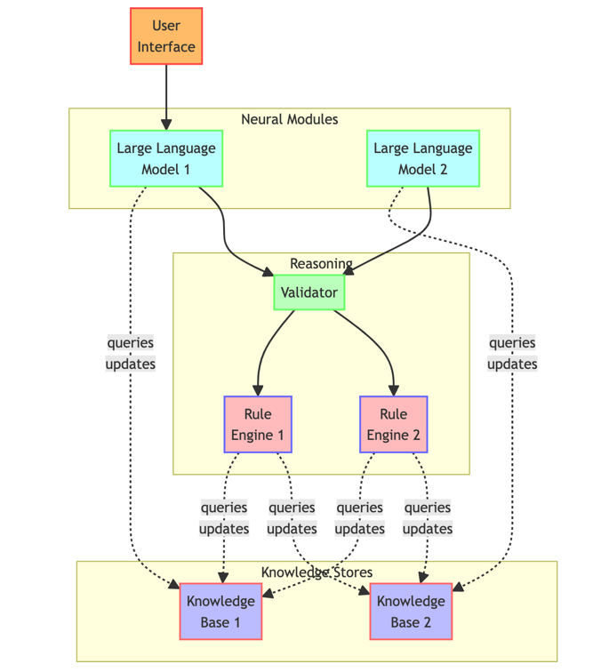

## Architectures
We next discuss system architectures that realize the synergies between symbolic KE and neural LLMs.

### Hybrid Neuro-symbolic Systems
Hybrid systems combine the strengths of computational reasoning using logics and probabilities with data-driven techniques like LLMs. One methodology incorporates [7]:
1. Knowledge bases like ontologies and rules that encode human knowledge
2. Vector databases that store embedded representations of entities and relations
3. LLM components that process text and interface with humans
4. Reasoning modules for inference chaining and verification

For example, a question answering application can use rules and ontologies for structured retrieval, retrieve relevant passages using vector similarity search, apply an LLM to analyze text and generate an answer, followed by logical verification.

Such hybrid architectures enable combining the precision of symbolic systems with the flexibility of LLMs. However, designing the orchestration between components raises research problems like seamless knowledge exchange, explaining inferences, and maintaining updated knowledge.

Evaluation tradeoffs are also nuanced, balancing aspects like response accuracy, consistency, and transparency. Benchmark design requires care to effectively compare hybrid systems to their symbolic or neural counterparts.

The key components include:

Knowledge base (KB): Contains the ontologies, rules, and facts
Vector database (VD): Stores embeddings of entities and relations
Large language model (LLM): Interfaces with user, processes text
Rule engine (RE): Performs symbolic reasoning and inference
Validator (VE): Checks LLM outputs for errors
The workflow is:

User interacts with the system via the LLM UI
LLM analyses text input and retrieves related facts as embeddings from the VD
LLM response is validated against rules
Symbolic reasoner further chains inferences using retrieved facts
Deduced facts updated back in VD and KB
The architecture allows combining strengths of symbolic and neural approaches in an integrated system.