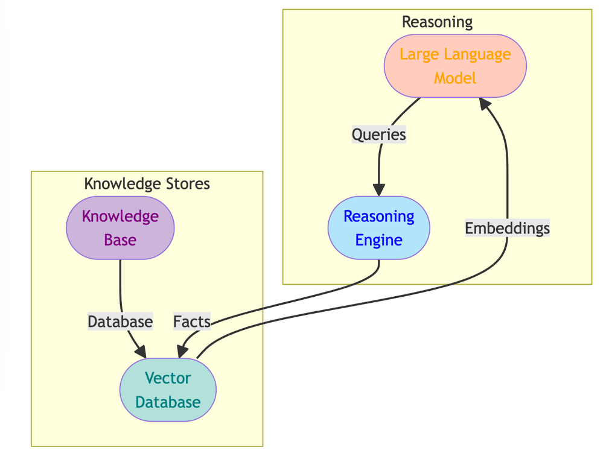
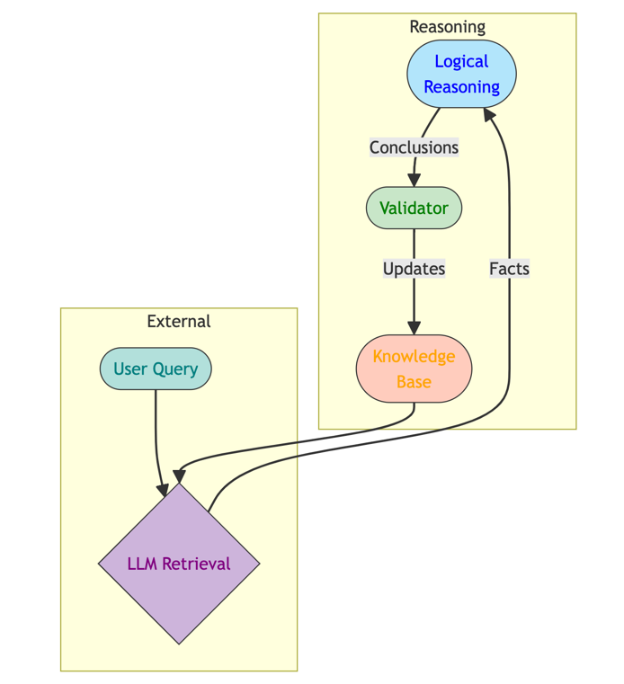

## Architecting Fluid Knowledge Systems: A Spotlight on Hybrid Neuro-symbolic Platforms

Hybrid platforms synergistically combine symbolic representations with neural techniques like large language models (LLMs). This enables blending rigid composability with fluid continuity across the AI-powered knowledge platform.

## The Yin and Yang of Symbolic and Neural
Hybrid systems interconnect four key components:

**Knowledge Base (KB):** Contains structured facts and logic rules curated by domain experts to establish integrity.

**Vector Database (VD):** Stores numeric embeddings that capture semantic essence of entities and relationships within the knowledge fabric.

**Large Language Model (LLM):** Provides natural language interface to query and expand the knowledge ecosystem based on contextual needs.

**Reasoning Engine (RE):** Enables chaining deductive inferences over existing facts and rules to uncover hidden insights.

## Orchestrating a Virtuous Knowledge Cycle

The components enable a flywheel effect sustaining continuous enrichment:

This architecture allows seamlessly harnessing both neural representations for similarity-based reasoning with symbolic logic for verifiable deduction within an integrated system.

## Surmounting Key Challenges
Realizing this vision requires crossing frontiers like:

**Consistent Knowledge Fusion:** Smooth interfaces between neural and symbolic paradigms.

**Explainable Deduction:** Audit trails for inference chains enabling trust.

**Evaluation:** Benchmarks assessing accuracy, consistency, and transparency.

The path forward necessitates synthesizing strengths across linguistic AI, formal logics, data engineering, and application domains. But the fruits justify the labor – ushering an era of vastly augmented productivity powered by adaptive knowledge architectures.
