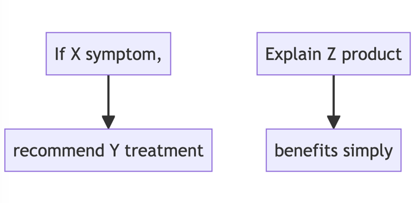
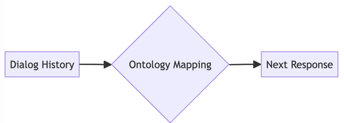
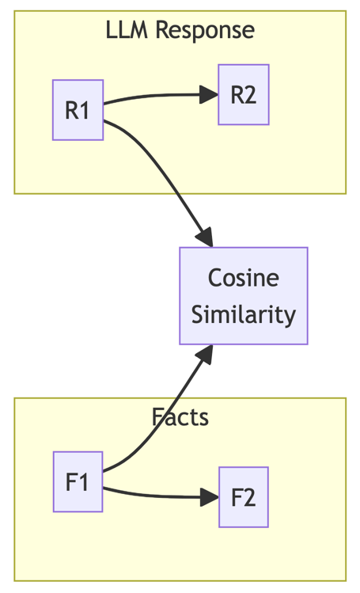

## Building Knowledgeable Assistants: Architecting Conversational Agents with Expertise

Conversational interfaces powered by large language models (LLMs) enable intuitive human-machine interaction. Integrating domain knowledge expands their capabilities into reliable advisors.

### Embedding Expertise through Prompts

Domain specialists encapsulate knowledge into conversational rules and prompt templates to guide the LLM:

"If X symptom, recommend Y treatment"  
"Explain Z product benefits simply"



Prompts act as soft constraints nudging generative direction.

### Orchestrating Dialogue Flows

Ontologies provide navigational maps for the LLM to understand dialog context. Dialog managers leverage these structures to switch conversation flows, ensuring natural progression using concepts like:

```
P(next response | dialog history, ontology)
```



### Safeguarding Reliability

LLM responses undergo verification against knowledge base facts to catch factual inaccuracies. Metrics like cosine similarity quantify closeness of generated statements to ground truth:

```
similarity(LM response, facts) = cosine(vector1, vector2)  
```



**Continuous Improvement**

Human experts refine responses, augment rules and expand the knowledge graph, enabling lifelong learning critical for real-world deployment.

### Key Challenges

Barriers span predictable dialog design, transparent explanations, scalable knowledge interlinking and rigorous longitudinal evaluation. Mitigating these risks while benefiting from lower expertise barriers via conversation is crucial.

Formal modeling still provides validation scaffolding. Synthesizing strengths of neural and symbolic techniques promises assistive agents that understand natural language while reliably advising within specialized domains.
