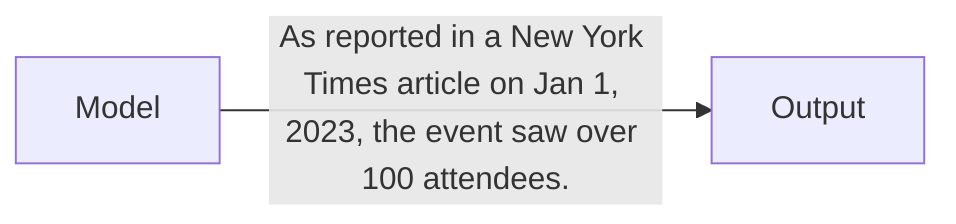
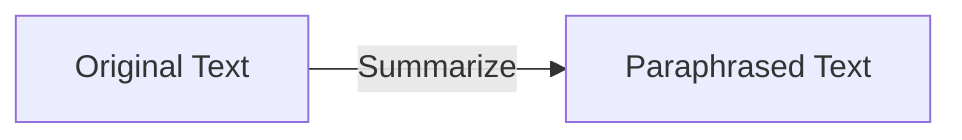
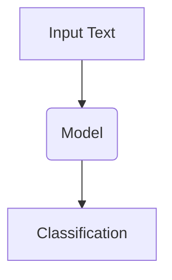
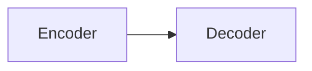
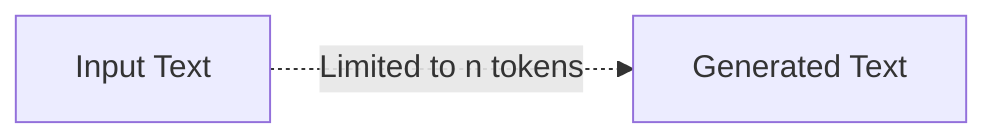
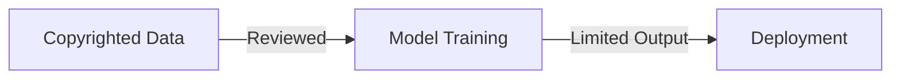

## Avoiding Copyright Infringement in LLM Training

Training large language models (LLMs) requires ingesting massive text datasets, often scraped from public sources like news sites and online books. However, care must be taken to avoid copyright infringement when using such data. This section analyzes the technical and legal aspects of training LLMs safely and responsibly.

### Attribution and Fair Use

Using copyrighted content for research and commentary is protected under fair use provisions in copyright law. To establish fair use in LLM training:

- Properly attribute the source of any quoted or summarized text in model outputs. For example:



- Only use small representative samples of source texts. Don't copy entire articles or books verbatim.

- Don't directly monetize the copyrighted portions of the trained model without permission. Revenue must come from application of the model, not replicated content.

Fair use rests on using minimal copied content for legitimate transformative purposes like research and commentary. Proper attribution assists this.

### Technical Mitigation Techniques

Several techniques can reduce verbatim copying of source texts:

- **Paraphrasing:** Text summarization and paraphrasing can generate novel phrasings of the underlying ideas in training data.



- **Abstraction:** Higher-level abstraction tasks like classification require less verbatim usage than generating text.



- **Novel Architectures:** Models like BART with encoder-decoder structure avoid auto-regressively parroting input texts.



- **Limited Generation:** Constrain maximum generated token length to minimize long verbatim passages.



- **Top-k Sampling:** Sample from top predicted next tokens, avoiding greedily selecting the most probable token each step. Creates more diverse outputs.

- **Beam Search:** Maintain multiple candidate generations to increase output diversity.

**Mathematically**, these techniques increase the **entropy** of the model's predicted token probability distribution $P(x_t)$ at each timestep $t$:

```
H[P(x_t)] = - ∑ P(x_t) log P(x_t) 
```

Higher entropy distributions have more uncertainty, producing more novel outputs instead of copying.

### Legal Compliance

Full legal compliance involves:

- Reviewing datasets and model outputs for any potential copyright infringement.

- Obtaining licenses where required for monetization.

- Honoring opt-out requests of authors who don't want their text used for AI training.

- Implementing technical protections against misuse like limiting text generation length.



Proactive communication with stakeholders including journalists, authors and publishers can help establish reasonable standards and licensing models for AI training data.

Overall, responsible AI requires respecting copyright law while harnessing data to advance research for the benefit of society. With proper attribution and limitations, AI models can learn from vast information while avoiding plagiarism. Ongoing collaboration between technology and creative fields can foster an equitable path forward.