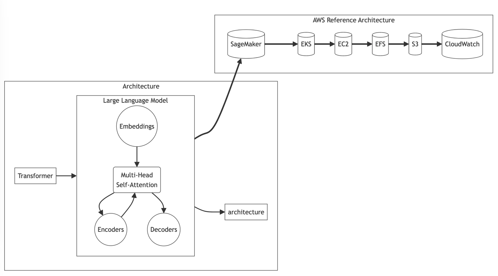

## LLMOps: Operating Large Language Models for Impactful Deployment

Deploying large language models (LLMs) into production requires streamlined operations spanning infrastructure, pipelines, monitoring and beyond. We refer to these operational aspects collectively as LLMOps - the key to impactful LLM deployment.

### LLM Architecture Powers Natural Language Processing

Modern LLMs like GPT-3 leverage the Transformer architecture to analyze statistical patterns in vast text corpora. We can visualize this as words dancing in a neural network, with their meanings swirling in vector embeddings.

The architecture allows models to interpolate between human-like behavior - understanding natural language, answering queries, generating text - while leveraging strengths of software like instant recall and parallel computation for accelerated response.

**Key Components Bring the Linguistic Ballet to Life:**

* **Embeddings & Encoders:** Words become vectors capturing meaning, processed to understand relationships.
* **Decoders & Attention:** Spotlight focus predicts the next word based on context.
* **Layers & Parameters:** Building blocks stacked tall to capture intricate language patterns.

### Scaling Parameters and Data Takes Performance to New Heights

Pioneering models like GPT-3 have pushed boundaries through scale - using orders of magnitude more parameters and data than predecessors like BERT.

We can visualize this as a chef perfecting a rich dish by incrementally adding more ingredients - enabling remarkably nuanced output. However, operationalizing the scale requires a symphony of specialized software and hardware. This is where LLMOps becomes crucial.

### AWS Reference Architecture: Constructing the LLM Playground

We need a robust playground for experiments, training runs, model iterations and low-latency serving. AWS provides a handy blueprint to architect such infrastructure:

* **SageMaker:** The personal trainer, optimizing experiments and managing models.
* **EKS:** Playground supervisor, provisioning clusters to power computations.
* **EC2:** Providing accelerated hardware like GPUs to handle complexity.
* **Storage Services:** Spaces to store huge datasets and model artifacts.
* **CloudWatch:** Monitoring performance like a watchdog.

Built ground-up for scale and experimentation velocity, this cloud architecture simplifies operating LLMs.

### Beyond Model Serving: Operational Considerations

While hosting the model on production servers is crucial, additional cross-cutting capabilities enable smooth operations:

* **Data Engineering:** Sourcing, cleaning and labeling massive corpora.
* **Experiment Tracking:** Managing model iterations with runs fully logged.
* **Pipeline Orchestration:** Chaining steps from experiment to production.
* **Cost Optimization:** Tuning cloud resource usage for efficiency.
* **CI/CD:** Testing and automating updated model deployment.
* **Monitoring:** Tracking metrics, logs and alerts for system health.

operational aspects into reality necessitates seamless collaboration between machine learning researchers, data engineers and IT administrators. Smooth handoff and version control between iterative experimental environments to production servers minimizes friction during this multifaceted process.

By combining architectural depth, human-centered analogies and highlighting key operational considerations, the integrated section clarifies the intricacies in functionally deploying industrial-grade LLMs.

## AWS Tech for LLMOps: A Comparison Table

This table outlines key AWS services for LLMOps categorized by the **LLMOps Bedrock** they address, along with additional services that enhance functionalities. Remember, this is a non-exhaustive list, and the specific needs of your LLM may require other services or configurations.

| Bedrock | AWS Services | Additional Services | Description |
|---|---|---|---|
| **Model Training & Experimentation** | SageMaker, Amazon AI Workbench, AWS Deep Learning AMI | S3 (Data Storage), CloudWatch (Monitoring), Amazon SageMaker Experiments | Streamline training, orchestrate experiments, track performance, and share models. |
| **Model Deployment & Serving** | SageMaker Inference, Lambda, EC2, EKS | Amazon API Gateway (API Management), Elastic Load Balancing (Scalability), AWS CloudFront (Content Delivery) | Deploy models for online or batch prediction, scale serving infrastructure, and optimize latency and cost. |
| **Data Pipelines & Feature Engineering** | Glue, AWS Lambda, Step Functions | S3, Lake Formation (Data Lake Management), Kinesis Data Firehose (Streaming Ingestion) | Build data pipelines for cleaning, preprocessing, and labeling training data, and automate feature engineering workflows. |
| **Monitoring & Observability** | CloudWatch, CloudTrail, X-Ray | Logs Insights (Log Analysis), Trusted Advisor (Cost Optimization) | Monitor model performance, track resource utilization, and debug issues with detailed logs and analytics. |
| **Security & Governance** | IAM, CloudKMS (Key Management), Security Hub | Cognito (Authentication), Inspector (Vulnerability Scanning) | Secure model access, manage cryptographic keys, and comply with security and governance regulations. |
| **Cost Optimization** | Spot Instances, Reserved Instances, Auto Scaling | Budgets & Cost Explorer | Minimize model training and serving costs through efficient resource allocation and utilization. |

**Bonus Services:**

* **MLflow:** Track model versions, metrics, and experiments across platforms.
* **Weights & Biases:** Track, visualize, and compare LLM performance across experiments.
* **Amazon Comprehend:** Extract insights and entities from text for improved data labeling and feature engineering.
* **Amazon Lex:** Build conversational interfaces powered by LLMs for chatbot applications.

Remember, choosing the right combination of services depends on your specific LLM needs, budget, and desired functionalities. Consider consulting with AWS experts to design a bespoke LLMOps architecture for your project.

#### More ...

* [Unlocking Open-Source LLM Power with Streamlined AWS LLMOps](llm_open_source.md)
* [Hugging Face: The Home of Open-Source LLMs](Hugging_Face.md)
* [LLM Transformer Architecture](Transformer.md)

### [Back](..%2Freadme.md)