## Powering Language: A Guide to LLM Training and Inference


## Introduction

Large language models (LLMs) like GPT-3 have demonstrated groundbreaking performance on a variety of natural language processing tasks like text classification, summarization, question answering etc.

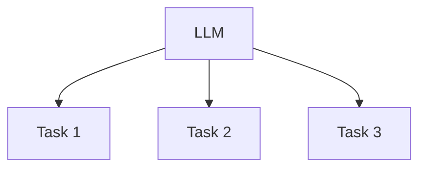

However, the training and deployment of such large models (10B+ parameters) requires substantial computational resources.

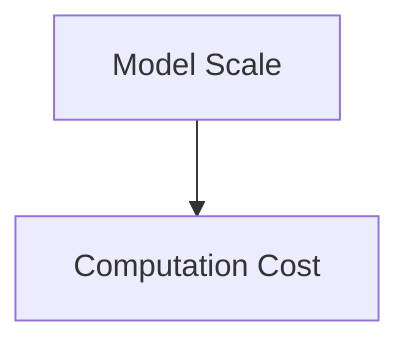

For example, training GPT-3 cost an estimated $12M. Hence research into efficiency enhancements for both training and inference of LLMs has gained prominence.

This paper provides a comprehensive review of methods to:

1. **Optimize LLM training** - Parallelism, mixed-precision arithmetic, checkpointing
2. **Enable efficient inference** - Quantization, pruning, compression
3. **Tuning for sample efficiency** - Few-shot learning, prompt-based learning

The goal is to equip LLM researchers and developers with knowledge of SOTA efficiency enhancements that can help democratize access and usage for downstream applications.


## Background Knowledge

**Transformer**

The Transformer is a neural network architecture that uses attention mechanisms instead of recurrence for sequence modeling. It consists of an Encoder and a Decoder.

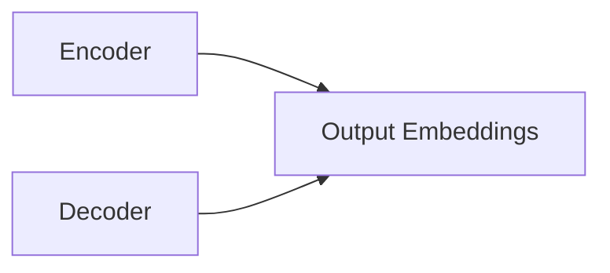

The Encoder maps an input sequence X = (x1, x2, ..., xn) to a sequence of continuous representations Z = (z1, z2, ..., zn). Each xi is mapped to a token embedding ei first.

```
e1, e2, ..., en = TokenEmbedding(x1, x2, ..., xn) 
```

Then the self-attention mechanism is applied to capture dependencies between tokens by computing alignment scores between them:

```
f(ei, ej) = Softmax((ei.WT).(ej.Wk) / √d)
```

Where WT and WK are learned projection matrices. This results in a context vector ci for each token that aggregates information about other tokens.

The Encoder output is computed by passing these context vectors through a feedforward network (FFN):

```
z1, z2, ..., zn = FFN(c1, c2, ..., cn)  
```

**Decoder**

The decoder autoregressively generates an output sequence Y = (y1, y2, ..., ym) token-by-token. It attends to previous decoded tokens using masked self-attention. It also attends to encoder outputs through encoder-decoder attention.


**Self Attention**

The self-attention mechanism establishes relationships between tokens in a sequence by comparing their relevance. It computes alignment scores between each pair based on dot product similarity:

```
Score(qi, kj) = (Wq*qi) . (Wk*kj)
```

Where qi and kj are query and key representations of tokens, and Wq, Wk are learned projections.

These scores are normalized using softmax to get attention weights α:

```
αij = Softmax(Score(qi, kj)) 
```

The context vector ci combines information about all tokens weighted by αij. This allows modeling long-range dependencies regardless of distance between tokens.

Calculates attention weights between input tokens based on relevance.

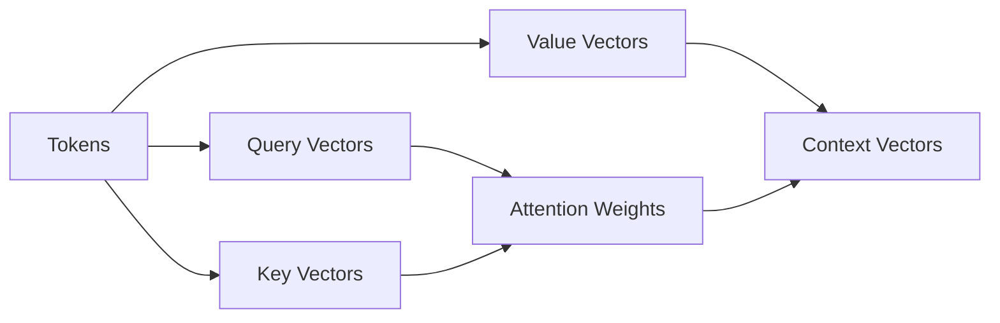

This allows capturing long-range dependencies for language understanding.


**Prompt Learning**

Prompt learning guides language models (LMs) for downstream tasks without full fine-tuning. Key components:

**Templates -** Prompts with masked tokens ([MASK]) or generation prefixes. Eg:

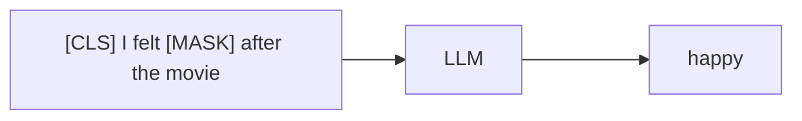

[CLS] is a special token to represent sentence classification tasks.

**Verbalizers -** Mappings of class labels to natural language words. Eg:

``` 
positive -> happy
negative -> sad
```

**LM Tuning -** Fine-tune prompt embeddings or full LM layers:

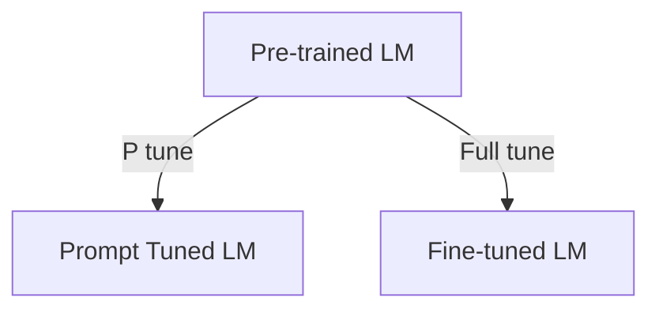

The template + verbalizer transform classification into language modeling:

```
P(y=positive | input) = P(O="happy" | template) 
```

This enables lightweight customization of LMs for different tasks via prompt tuning instead of intensive full fine-tuning.


## LLM Training

**Data**

LLMs require large amounts of textual data for pre-training. Common data sources include:

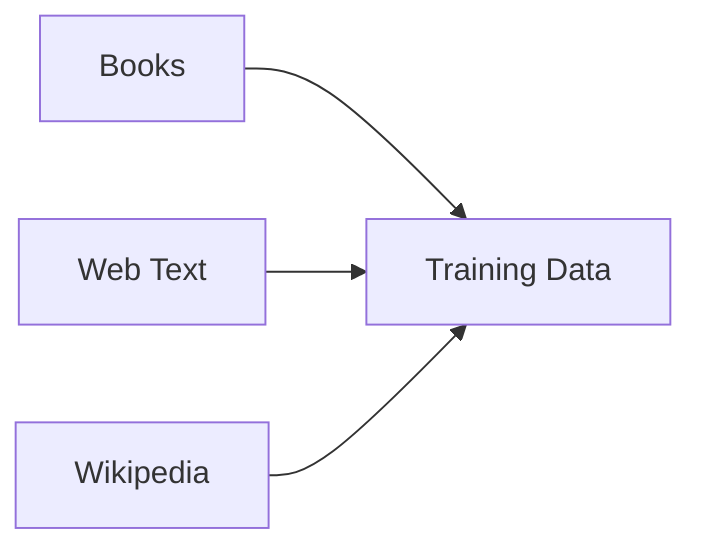

Text is preprocessed to improve quality:
- Filtering - Remove toxic, biased content
- Deduplication - Eliminate repetitive passages
- Anonymization - Scrub private information

Let X = {x1, x2, .... xn} represent the pre-training corpus after preprocessing, where each xi is a textual passage. The goal of pre-training is to maximize the log-likelihood:

```
L(X) = Σ log P(xi)
```

By modeling the probability distribution over sequences in the training data.


## Architecture

LLMs use the Transformer architecture which has two main components:

**Encoder**

The encoder maps an input sequence X to a sequence of continuous representations Z. It consists of:

- Multi-head self-attention layers
- Feedforward neural network layers

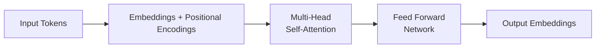

**Self-Attention Layer:**

Converts input x ∈ Rdx into queries Q, keys K and values V:

```
Q, K, V = xWQ, xWK, xWV 

where WQ, WK, WV ∈ Rdxxdh   (dh - representation dimension)
```

The attention weights between x and all elements y ∈ X is computed as:

```
Attention(x,y) = softmax(Qx . Ky / √dh)
```  

The output combines values V weighted by the attention:

``` 
z = ∑ Attention(x,y) . Vy
```

Captures global dependencies through dot-product (distance) self-attention

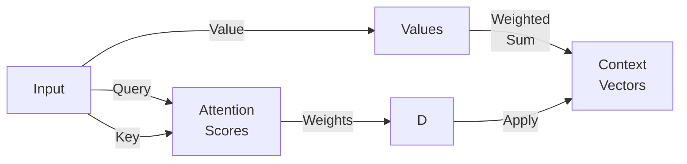

Where the Attention Scores box B earlier represented:

```
(Query x Key) / sqrt(dk)
```

**Feed Forward Layer:**

A position-wise neural network that processes each z independently:

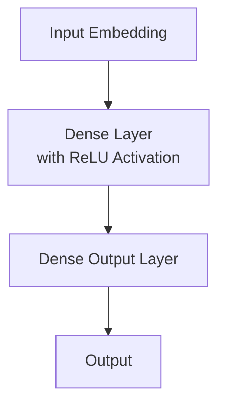

Mathematically:

```  
FFN(x) = max(0, xW1 + b1) W2 + b2
```

Where:
- W1, b1 are weights and biases of the first dense layer
- max(0, .) applies the ReLU non-linearity
- W2, b2 are weights and biases of the output dense layer

The FFN processes each input embedding independently with this simple 2-layer neural network to transform the representations. Stacking multiple encoder blocks with self-attention followed by the FFN enables modeling complex relationships in input text.


**Decoder**

The decoder autoregressively generates the output sequence one token at a time using masked self-attention over previously generated tokens.

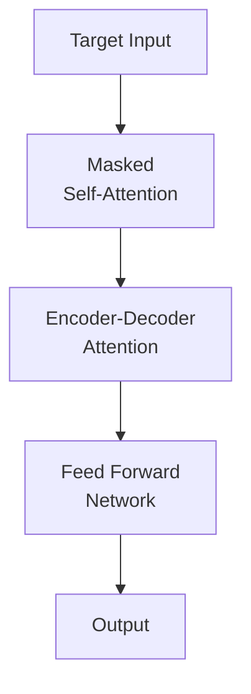

## LLM Training Techniques

Key methods to enable efficient large scale training:

**Data Parallelism**

Split data across GPUs to train bigger batch sizes:

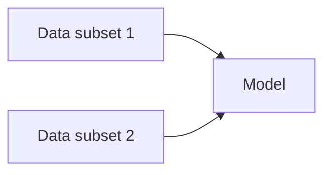

Total batch size = sum of per-GPU batches

**Mixed Precision**

Use FP16 (half precision) where possible, store master weights in FP32:

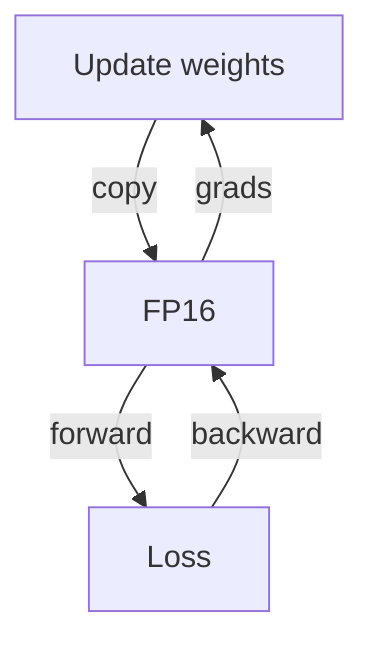

Reduces memory and communication costs.

**Gradient Accumulation**

Aggregate gradients over multiple batches before weight update:

```
weighted_grad = (grad1 + grad2 + ... + gradn) / n
```

Allows larger effective batch size.

**Fine-Tuning**

Specialized training on downstream tasks:

**Supervised Fine-tuning**

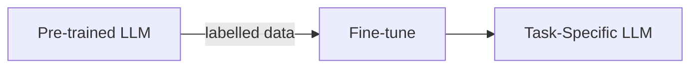

**Prompt-based Tuning**

Only tune prompt embeddings:


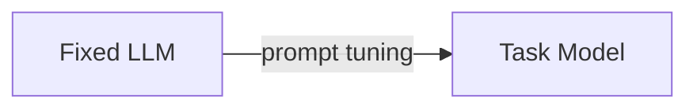

Lightweight alternative without full retraining.


## Evaluation 

Key criteria:

**Quality**

**Automated Metrics:** Numeric match to reference texts - BLEU, ROUGE, METEOR etc:


**BLEU**

Measures precision of n-gram matches between candidate (C) and references (R)

```
BP = exp(min(0, 1 - R/C)) (brevity penalty) 

pn = matched n-grams / total n-grams in C 

BLEU = BP * exp(∑wn log pn)
```

log pn rewards higher order matches. wn are positive weights summing to 1.

> Bilingual Evaluation Understudy - computes precision of n-gram overlaps between candidate and reference texts. Weights and aggregates matches from uni-grams to higher order n-grams.

**ROUGE**

Compute overlapping n-grams between C and R:

```
Recalln = Countmatch(n-grams) / Count(n-grams in R)

ROUGE-N = Harmonic mean of Recalln 
```

Matches are allowed with stem/synonym based similarity.

>  Recall-Oriented Understudy for Gisting Evaluation - measures overlap in terms of n-gram recall between candidate and references. Variants like ROUGE-L also consider longest common subsequence.

**METEOR**

Alignment score based on:
- Exact token matches
- Stemmed tokens
- Semantic similarities

```
m = ∑ (unigrams matched)

p = m / unigrams in C  

Meteor = (1 - Penalty) * Fmean
```  

Penalty from longest alignment between C and R.
Fmean combines precision p and recall r.

>  Measures alignment between candidate and references at word/phrase level. Scores based on explicit matches, stems, and semantic similarities.

**BERTScore**: Computes similarity using contextual embeddings from pre-trained models like BERT. Matches token representations using cosine similarity.

**Human Evaluation:** Ratings on relevance, fluency, coherence etc.

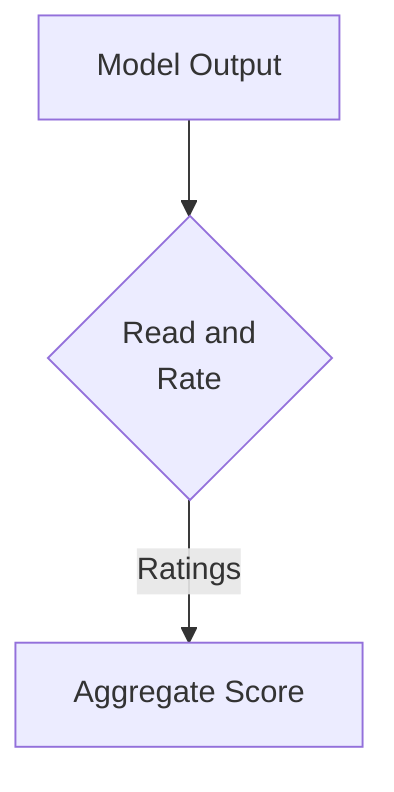

**Safety**

**Bias Evaluation:** Test model outputs for biases using checklist tests:

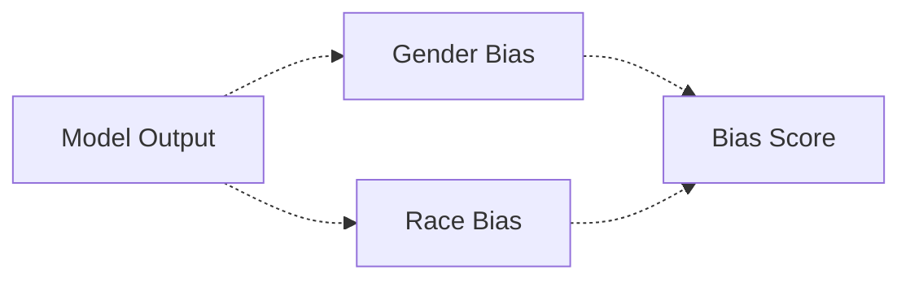

**Adversarial Evaluation:** Assess sensitivity to inputs designed to trigger unsafe behavior:

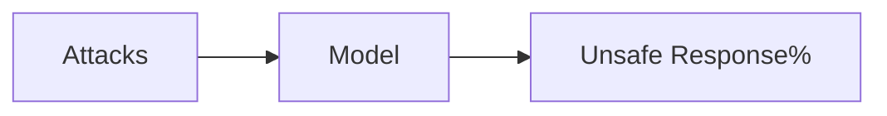

## Inference and Serving

Running large language models in production requires optimizing for latency, throughput and cost.

**Compression**

**Pruning:** Remove redundant connections based on importance metrics:

```
p = argmin ¦W¦  s.t. LB < f(W') < UB
```

Prunes to minimize ¦W¦ while maintaining accuracy bounds.

**Quantization:** Reduce numerical precision of weights:

```
Wf = round(W/Q) * Q 

Q - quantization step size
```

**Acceleration**

**Flash Attention:** Reduce memory access using chunked attention computation:


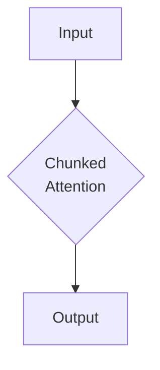

**Deployment**

**Parallel Inference**

Split model layers across GPU fleet with pipeline parallelism:

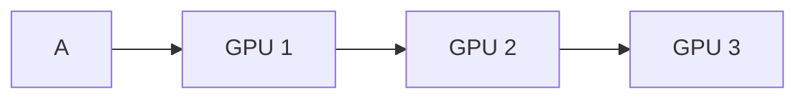

**Cloud Deployment:**

Autoscaling groups of EC2 GPU instances on AWS with load balancers:

```mermaid
graph BT
    subgraph Request Routing
        LB[Load <br> Balancer]
    end
    subgraph AutoScaling Group 
        G1[GPU Instance]
        G2[GPU Instance] 
        G3[GPU Instance]
    end 
```

### Serving LLMs on SageMaker

Amazon SageMaker helps deploy, scale and manage large language models in production.

**SageMaker Endpoints**

Managed endpoints to serve inferences with autoscaling capacity:

```mermaid
sequenceDiagram
    Client->>Endpoint: Prediction request
    Endpoint->>Backend: Forward request 
    Backend-->>Endpoint: Prediction
    Endpoint-->>Client: Return prediction
```

Supports canary deployments, A/B testing etc.

**Inference Servers**

Amazon SageMaker inference servers like Tensorflow Serving handle prediction workloads:

```mermaid
graph LR
    Endpoint-->Server[Inference Server]
    Server-->Worker1[Model Worker]
    Server-->Worker2[Model Worker] 
```    

Take advantage of batching, auto-scaling, metrics and tracing.

**Optimization**

Compression, acceleration and parallelization techniques improve throughput and reduce costs.


## Utilization of LLMs

Pre-trained large language models (LLMs) enable a variety of downstream natural language tasks:

**Few-Shot Learning**

LLMs exhibit strong few-shot learning capabilities. By providing a few input-output examples, they can adapt to new tasks:

```mermaid
sequenceDiagram
    User->>LLM: Example 1 Input : Output  
    User->>LLM: Example 2 Input : Output
    User->>LLM: New task input
    LLM-->>User: Generated output
```

This alleviates data scarcity challenges.

**Conditional Generation**

LLMs can generate specific outputs based on given context and prompts:

```mermaid  
graph LR 
   C[Context] & P[Prompt]-->LLM-->O[Output]
```

Enables controlled text and image generation applications.

**Domain Fine-tuning**

LLMs can be adapted to specialized domains by continued pre-training on in-domain datasets. This enhances performance on domain-specific tasks.

## Future Directions

Key trends in LLMs:

**Scalability** - Models will continue to scale up in size unlocking greater capabilities. Compression techniques are vital to ensure feasible deployment.

**Multimodality** - Extend abilities beyond just text to process images, video, speech and more. Enables more human-like perception.

**Efficiency** - Reducing computational and carbon footprint of LLM development is an urgent challenge. Quantization, pruning, knowledge distillation and other optimizations help address this.

**Responsible AI** - As LLMs become more capable, maintaining alignment with human values is critical through techniques like reinforcement learning from human feedback.

## Conclusion

This section provided an overview of trends in efficient pre-training, inference and utilization of LLMs. As LLMs grow more advanced and widespread, an interdisciplinary approach balancing innovations in AI with ethical, social and environmental considerations will prove vital. Maintaining accessibility along with progress remains imperative.

### [Back](..%2Freadme.md)
