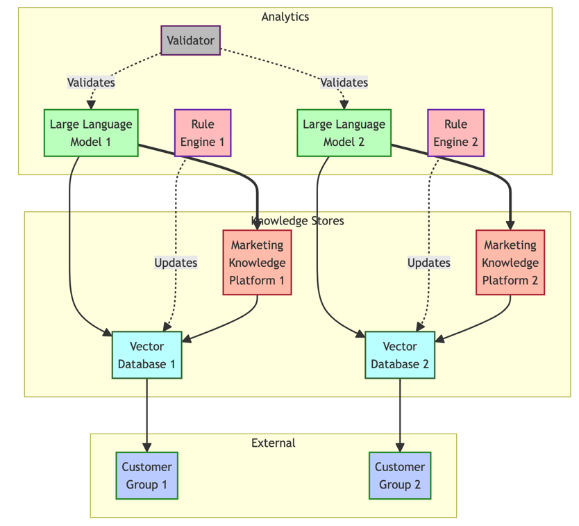
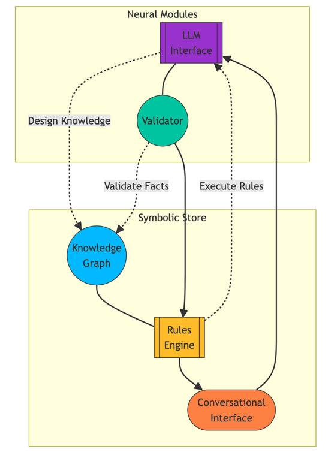

## Knowledge Engineering & LLMs for Marketing Technology

Marketing technology (MarTech) aims to achieve efficient and effective marketing using capabilities from computer science and information technology. Knowledge engineering using LLMs provides new opportunities for MarTech across customer intelligence, content optimization, and campaign orchestration.

### Technical Foundations

We can formally represent a marketing knowledge graph as:

```math
G_{M} = (V_{M}, E_{M}) 
```

Where the vertex set $V_{M}$ contains entities like customers, products, campaigns etc. And the edge set $E_{M}$ represents relations like `purchased`, `viewed`, `responded` etc.

Key knowledge engineering tasks in MarTech using LLMs include:

**Customer Intelligence**: Use LLMs to extract insights from customer engagement text and dialog. Build conversational agents to provide omni-channel support.

**Content Optimization**: Employ LLMs for natural language generation of marketing assets like ad creatives, landing pages, emails. Ensure personalization and consistency.

**Campaign Orchestration**: Construct hybrid systems with LLMs to determine optimal targeting and budgets. Ensure reasoning transparency.

A sample neuro-symbolic architecture is:



The key components include:

1. Marketing Knowledge Platform (MKP): Central knowledge store with facts, rules, models
2. Vector Database (VD): Customer embeddings
3. Large Language Model (LLM): Analyze interactions
4. Rule Engine (RE): Execute marketing logic
5. Validator (VE): Check LLM outputs

This allows combining neural and symbolic techniques for marketing automation in a hybrid system.

### Provider Comparison
Here is the provider comparison table again followed by detailed explanations for each vendor:

### Provider Comparison

| Vendor | Generative Capabilities | Marketing Focus | Hybrid Offering |
|-|-|-|-|
| Anthropic | High | Low | No |
| Cohere | Medium | Low | No |
| IBM Watson | Medium | Medium | Yes | 
| Adobe Sensei | High | High | Yes |
| AWS Personalize | Low | High | No | 
| Microsoft Personalizer | Medium | Medium | Yes |
| OpenAI ChatGPT | High | Low | No |

### Anthropic

Anthropic offers Claude, an advanced conversational AI assistant focused on safety. It uses a technique called constitutional AI to make Claude helpful, harmless, and honest. Claude has high generative abilities, able to understand contexts and carry out fluid conversations. However, it lacks specific marketing capabilities out of the box. As an innovative startup, Anthropic's focus is on core NLP research rather than purpose-built solutions for verticals like marketing.

### Cohere

Cohere provides a natural language API for developers to build custom AI applications. It has medium-level generative capabilities to understand language and generate human-like text. However, Cohere does not offer pre-built solutions for marketing use cases. The onus would be on engineering teams to leverage the API for scenarios like content generation or personalization.

### IBM Watson

IBM Watson is an established cognitive computing platform spanning machine learning, NLP, computer vision and more. With services like Watson Assistant, it provides a combination of generative abilities like conversational interfaces as well as more tailored solutions for marketing use cases like personalized recommendations and predictions. It offers a hybrid approach suitable for enterprises.

### Adobe Sensei

Adobe Sensei is the AI and machine learning framework tightly integrated with Adobe's range of creative, marketing and analytics solutions. With high generative powers and specialization for digital marketing needs, Sensei can automatically generate content variations, predict customer behavior, recommend next best actions and more.

### AWS Personalize

AWS Personalize is Amazon's purpose-built personalization and recommendation service for real-time individualized experiences across channels. It focuses squarely on marketing use cases but has limited generative capabilities out of the box. The onus would be on engineering teams to stitch together additional AWS AI building blocks.

### Microsoft Personalizer

Part of Azure Cognitive Services, Microsoft Personalizer uses reinforcement learning to provide real-time recommendations optimized for user engagement. While it lacks advanced generative powers, Personalizer combines analytical decisioning capabilities tailored for marketing with Azure's broader machine learning toolset in a hybrid approach.

### OpenAI ChatGPT

OpenAI's ChatGPT has exceptional natural language generation abilities and can carry out remarkably human-like conversations on almost any topic. However, it does not offer purpose-built capabilities for digital marketing functions like campaign analytics or customer journey orchestration. The onus would be on engineering teams to customize its open API for closed-loop applications.

## Strategic Direction
Marketing technology aims to drive business growth by applying emerging capabilities from data and technology. Knowledge engineering methodologies powered by large language models open new strategic opportunities to advance marketing automation and analytics.

Specifically, LLMs can enhance three key pillars:

**Customer Intelligence**
- Analyze multichannel customer data including text, voice and interactions using LLM-based analytics to identify trends, intents and attributes
- Build conversational interfaces powered by LLMs to provide personalized recommendations and support across channels like web, mobile apps, call centers and stores
- Maintain a customer data platform as the central store for profiles, event streams and model outputs

**Content Optimization**
- Use LLMs to dynamically generate and optimize marketing content like ads, emails and landing pages
- Personalize messaging while maintaining brand voice by establishing guidelines, workflows and approvals
- Manage a digital asset repository with pre-approved content blocks and assets for assembly

**Campaign Orchestration**
- Construct hybrid recommendation engines with LLMs to determine optimal targeting and budgets
- Embed business rules, constraints and scenario modeling to ensure reasoned, explainable decisions
- Validate campaign performance forecasts against ground truth using a model research environment

The key is developing hybrid architectures that symbiotically combine symbolic knowledge platforms with LLM interfaces:



This allows fusing the precision and auditability of knowledge graphs with the creativity and intuition of LLMs.

Orchestrating the components for intuitive authoring, reliable reasoning, and impactful delivery necessitates solving research challenges around evaluation, knowledge fusion, and conversational interaction at scale.

We can analyze the strategic scenarios across three key pillars:

| Scenario | Description | Key Components | Providers |
|-|-|-|-|
| Customer Intelligence | Derive insights from customer data using LLMs for analytics. Build conversational agents for personalized experiences. | - LLM for analytics<br>- Conversational interface<br>- Customer profile store | Anthropic, Adobe, IBM, Microsoft |
| Content Optimization | Use LLMs to dynamically generate and optimize marketing assets. Ensure personalization while maintaining brand consistency. | - LLM content generator<br>- Brand guidelines store<br>- Workflow orchestrator | Adobe, OpenAI, IBM |  
| Campaign Orchestration | Construct hybrid systems with LLMs to determine optimal targeting and budgets. Ensure explainable decisions. | - Knowledge graph<br>- LLM interface<br>- Rules engine<br>- Model validator | Adobe, Microsoft, AWS |

Key Capabilities Across Scenarios:

| Provider | Generative Abilities | Vertical Expertise | Hybrid System |  
|-|-|-|-|
| Anthropic | High | Low | No |
| Adobe Sensei | High | High | Yes |
| IBM Watson | Medium | Medium | Yes |
| AWS Personalize | Low  | High | No |
| Microsoft | Medium | Medium | Yes |
| OpenAI | High | Low | No |

The analysis shows Adobe's strength in marketing use cases while Anthropic and OpenAI excel in generative abilities. AWS Personalize lacks broader AI capabilities. IBM, Microsoft offer rounded hybrid systems.

Overall, integrating generative capacities with marketing stacks via hybrid tools provides an enterprise-grade approach. Realizing the potential necessitates overcoming integration, collaboration and transparency challenges.
