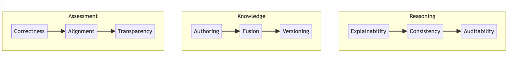
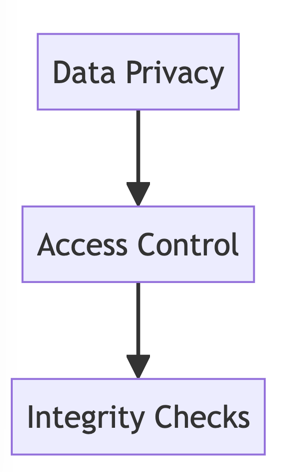

## Navigating the Crests and Troughs: Challenges and Opportunities for LLM-powered Knowledge Systems

Realizing industrial-grade knowledge solutions demands crossing frontiers across capabilities, evaluation, and integration:

### Reasoning

Prompt programming guides but complex deductive chains necessitate hybrid symbolic orchestration for mission-critical use.

### Knowledge

Smooth exchange between neural insights and symbolic structures necessitates consistent membranes and synchronized stores.

### Assessment

Multifaceted evaluation combining test suites and human assessment provides holistic reliability analysis.

### Additionally, key aspects include:

The challenges span theory, systems, and applications across sectors like healthcare, finance, marketing and more.

### Surfacing Hidden Gems in Marketing Technology

(Insert the additional section on Knowledge Engineering & LLMs in Marketing Technology here)

Overcoming these barriers necessitates cross-disciplinary breakthroughs fusing strengths across machine learning, knowledge representation, linguistics, and specific domains.

The fruits warrant the effort - ushering an era of vastly enhanced autonomy and productivity where humans and machines collaborate synergistically rather than compete.

### [Back](..%2Freadme.md)