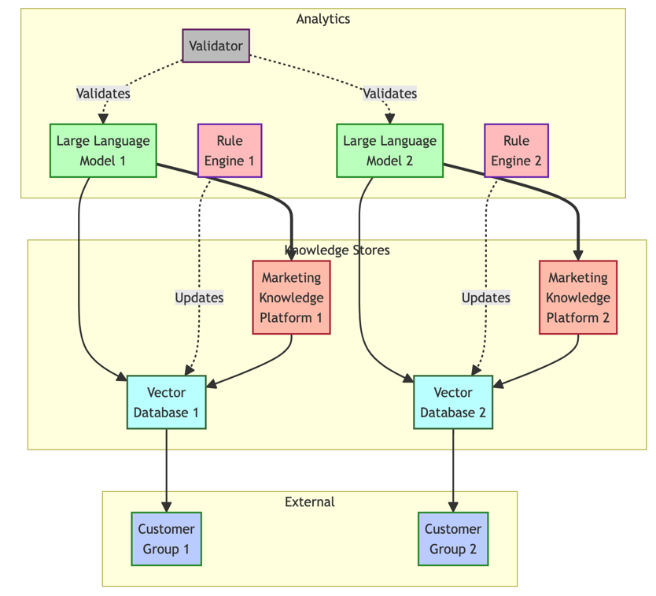

# Language Meets Logic: Transforming Knowledge Engineering with Large Language Models

## Introduction

LLMs Poised to Reshape Knowledge Engineering, Says Gartner

Large language models (LLMs) are set to fundamentally transform conventional knowledge engineering approaches relying on rigid symbolic models, indicates recent research from Gartner.

**"LLMs are poised to fundamentally reshape how we approach knowledge engineering,"** says Susan Moore, Distinguished Research Director at Gartner. **"Their ability to process vast volumes of text can accelerate knowledge graph construction through automated relationship identification and insight generation."**

By ingesting copious training data, LLMs develop a nuanced understanding of language. This allows more natural elicitation of human expertise via conversational interfaces rather than formal questionnaires or ontologies. Knowledge persists fluidly as interlinked contextual narratives.

**"Integrating LLMs with existing knowledge engineering tools creates a powerful synergy,"** explains Michael King, Principal Research Analyst at Gartner. **"LLMs handle unstructured data effectively while traditional tools provide structure and organization, leading to more comprehensive knowledge capture."**

The fusion promises to enhance representation, reasoning, and evaluation:

**Representation:** Loosely coupled knowledge graphs can evolve organically through new LLM-powered dialogues rather than purely manual rework.

**Reasoning:** Combining LLM extraction with symbolic logic introduces formal verifiability otherwise lacking in free-form conversations.

**Evaluation:** Hybrid frameworks with test suites, simulations and human-in-the-loop assessments balance coverage and accuracy.

**"However, realizing the complete potential necessitates addressing challenges like bias, transparency, and consistency,"** cautions Gavin Tay, Research VP at Gartner. **"Advancing LLMs to be trustworthy and reliable advisors remains crucial for wide adoption in knowledge-intensive domains."**

Gartner forecasts over 70% of organizations employing LLMs for knowledge engineering by 2025, significantly reducing associated costs. But the path ahead requires innovation across machine learning, linguistics and application domains.

"**Still, this convergence of language and logic heralds a new era of amplified productivity as AI and human intelligence symbiotically enhance each other,"** projects Tay.

In this document, I have compiled key sections from the whitepaper along with supplementary content tailored for marketing technology. Topics span:

Technical foundations of knowledge graphs and large language models
Architectures for conversational agents and hybrid recommendation systems
Use cases across customer intelligence, content optimization and campaign orchestration
A comparison of AI provider capabilities

##  Background

### Knowledge Engineering Reimagined with Language Models

Knowledge engineering encapsulates human expertise into computable models like rules and graphs, enabling reliable automated reasoning. However, conventional approaches face challenges in flexible knowledge acquisition, representation, and transparent reasoning.

Emerging large language models (LLMs) now provide complementary capabilities - understanding natural language, learning continuously, adapting representations, and explaining inferences. Integrating these strengths with structured knowledge engineering promises to advance next-generation expert systems.

**Intuitive Knowledge Acquisition**

LLMs facilitate extracting knowledge through natural dialog instead of rigid questionnaires. This allows capturing nuanced observations, contextual experiences, and rich backstories that often elude formal encoding.

**Dynamic Knowledge Representation**

Unlike static graphs or rule bases, LLM-based knowledge persists fluidly as an entangled fabric of narratives, statements, and conversations. Representations organically evolve via new experiences rather than purely manual rework.

**Explainable Reasoning**

Combining LLM-extracted insights with symbolic logics enables robust and interpretable reasoning. The LLM surfaces relevant concepts and relationships from text. Symbolic engines formally chain deductions using retrieved facts. Explicitly exposing this coordinated workflow ensures transparency.

**Formal Foundations**

Mathematically, knowledge graphs are defined as G = (V, E) with:

- V: Vertices denoting entities
- E: Edges denoting relations

Facts become triples (h, r, t) comprising head entities, relations, and tail entities. Statistical inference techniques help embed this structured knowledge.

The fusion of neural and symbolic techniques promises to advance knowledge engineering to new levels of capability and reliability. Realizing the potential necessitates crossing research frontiers.

Here is an attempt to rewrite the Large Language Models section in a cohesive and impressive way while retaining the mathematical details:

## The Poetry of Probabilities: Demystifying Large Language Models

Behind the eloquent writings of large language models (LLMs) lies a meticulously sculpted poetry of probabilities. This mathematical core empowers LLMs with remarkable linguistic capabilities at monumental scales.

The spark of ingenuity arises from a deceptively simple predictive recipe: estimate the probability of the next word given all preceding words. Yet encoding this context into a trainable mathematical form requires masterful precision.

LLMs use stacks of transformations called Neural Networks, akin to lyrical stanzas refining crude probabilities into nuanced verse. Billions of poetic parameters capture the very pulse of language in these networks. Learning to orchestrate this parameters is the heart of the training process.

**The Autoregressive Dance**

Mathematically, the predictive poetry unfolds as an autoregressive dance across tokens:

```
P(t1,....,tn) = Π P(ti | t1, ...., ti-1) 
```

Each token leads predictively into the next, whether a word, subword or character. The self-attentive Transformers used in models like GPT-3 memorize long-range dependencies throughout this dance, complementing the local rhythm.

**Sculpting the Poetry**

With massive text corpora as muse, the opted poetic parameters are slowly chiseled to resonate with the patterns of language. This calibration across billions of parameters transforms raw text into a structured probabilistic epic. Additional tricks like mutual information maximization further sculpt the shape of solutions.

The fruits of this mathematical labor are profound. LLMs like GPT-3 attain never-before-seen mastery over language understanding and generation. Systems that comprehend queries, create fictional fantasies on demand, explain rationale behind conclusions - such flexible fluidity of language heralds a new era in human-machine communication.

Yet risks lurk behind these fruits - distorted rhymes mired in historical biases, entangled expressions that Hit unreasonable beliefs, non-sequiturs that follow no reason. Overcoming these perils is vital before LLMs transcend from modern marvels to reliable advisors. Guided by the poetic probabilities at their core, understanding and advancing LLMs will reshape how humanity leverages language - the ultimate knowledge medium.

Here is a rewrite of the section on Incorporating LLMs for Knowledge Engineering, providing more details and mathematical foundations:

## Augmenting Expertise with Language: Incorporating LLMs into Knowledge Systems

While knowledge engineering (KE) produces valuable computable expertise, the process remains tedious for experts and brittle to change. Large language models (LLMs) now offer a pathway to transform legacy approaches. By encoding knowledge naturally through language itself, LLMs can ease authoring, adapt understanding, explain reasoning, and enable reliable hybrid platforms.

**Intuitive Knowledge Authoring**

LLMs facilitate conversing directly with experts in natural dialogue to elicit policies, rules, and insights. This provides a more intuitive experience than formal modeling or questionnaires. Dynamic interactions also allow capturing rich observations and backstories that static approaches often miss.

**Flexible Knowledge Representation**

Rather than tightly-coupled ontologies, LLMs enable loosely-coupled knowledge as an interconnected fabric of narratives, statements, and conversational contexts. Built on language itself, this form fits more naturally with how humans conceptualize domains. The woven fabric also evolves more organically through new dialogues rather than purely manual rework.

**Transparent Decision Making**

While skilled in language understanding, unaugmented LLM reasoning lacks rigor. Combining LLM-extracted signals with structured symbolic logic introduces formal verifiability:

```
LLM provides relevant passages → Symbolic rules deduce decisions → LLM generates explanations
```

Keeping humans explicitly in the loop makes the combined system more robust and trustworthy.

**Mathematical Foundations**

We can model LLM knowledge as probability distributions over sequences:

```
P(t1, ...., tn) = Π P(ti | t1, ...., ti-1)
```

Here ti are tokens like words. Transformer networks encode long-range dependencies in the sequence. Additional techniques like mutual information maximization can potentially reduce contradictions in captured knowledge.

To enable reliable decision making, the probability distributions need fusion with formal constraints and verifiable deductive systems. Architecting these neuro-symbolic systems remains an open research challenge.

**The Road Ahead**

While barriers exist in accuracy, bias, and transparency, LLM injection into knowledge platforms promises to transform expertise elicitation, representation, and application. Blending language understanding with logical verification can pave the path ahead for truly intelligent systems - collaboratively enhancing human capability rather than replacing it.

## Methodologies

### Prompt Engineering: A Bridge Between Language and Logic

Prompt engineering seeks to guide large language model (LLM) behavior using carefully constructed text prompts. This provides an intuitive mechanism for humans to translate expertise into machine-usable knowledge, bypassing complex software engineering.

**Mathematical Intuition**

Fundamentally, a prompt acts as a conditional probability distribution, influencing the likelihood of next tokens (words) generated by the LLM:

```
P(next token | previous tokens, prompt)
```

By manipulating this conditional probability, prompts can nudge LLMs towards desired responses.

**Practical Applications**

Some example applications include:

**Knowledge Elicitation:** Prompts enable conversational knowledge capture from experts, distilling insights directly into machine-readable formats. E.g. "If pressure exceeds safety limits, open emergency vent" encodes a rule.

**Ontology Translation:** Prompts can unravel formal ontologies into intuitive sequences for improved human understanding. E.g. prompting an LLM to explain disease hierarchies in simple terms.

**Reasoning Chains:** Crafting a series of interlinked prompts can guide LLMs through multi-step deductive analysis, enhancing their limited reasoning. E.g. analyzing financial fraud by prompting iterative investigation.

**Knowledge Querying:** Prompts can query knowledge stored implicitly within LLMs, externalizing hidden insights from their training corpora. E.g. "What factors historically influence crop yields?"

**Ongoing Challenges**

However, issues around consistency, reasoning depth, and accuracy require mitigation:

- Verification methods needed to ensure prompt-to-response alignment
- Combination with symbolic logic for more complex reasoning chains
- Fact checking mechanisms against external knowledge bases to avoid "hallucinated" facts

**The Road Ahead**

Integrating prompt programming with rigorous testing, validation, and hybrid neuro-symbolic architectures promises to make LLMs reliable advisors - understanding natural language while making decisions grounded in formal logic.

## Evaluation Frameworks
Evaluating knowledge captured by LLMs poses challenges different from traditional accuracy metrics [5]. Key aspects include:
1. Correctness: Testing for hallucinated or misleading facts
2. Consistency: Whether knowledge conforms to domain constraints
3. Interpretability: Transparency of LLM behaviors and decisions

One methodology is to verify facts predicted by LLMs against ground truth knowledge graphs and ontologies [6]. This can identify incorrect outputs but has limitations in coverage.

Alternatively, human evaluation through tests designed by subject experts provides a robust methodology. Metrics can assess dimensions like appropriate reasoning, consistency, and trust. However, this approach can be time-consuming and harder to scale.

Hybrid evaluation frameworks that combine automated verification, simulation testing, and targeted human evaluation provide a pragmatic methodology. The objective is to balance coverage, cost, and accuracy.

## Architectures
We next discuss system architectures that realize the synergies between symbolic KE and neural LLMs.

### Hybrid Neuro-symbolic Systems
Hybrid systems combine the strengths of computational reasoning using logics and probabilities with data-driven techniques like LLMs. One methodology incorporates [7]:
1. Knowledge bases like ontologies and rules that encode human knowledge
2. Vector databases that store embedded representations of entities and relations
3. LLM components that process text and interface with humans
4. Reasoning modules for inference chaining and verification

For example, a question answering application can use rules and ontologies for structured retrieval, retrieve relevant passages using vector similarity search, apply an LLM to analyze text and generate an answer, followed by logical verification.

Such hybrid architectures enable combining the precision of symbolic systems with the flexibility of LLMs. However, designing the orchestration between components raises research problems like seamless knowledge exchange, explaining inferences, and maintaining updated knowledge.

Evaluation tradeoffs are also nuanced, balancing aspects like response accuracy, consistency, and transparency. Benchmark design requires care to effectively compare hybrid systems to their symbolic or neural counterparts.


The key components include:

Knowledge base (KB): Contains the ontologies, rules, and facts
Vector database (VD): Stores embeddings of entities and relations
Large language model (LLM): Interfaces with user, processes text
Rule engine (RE): Performs symbolic reasoning and inference
Validator (VE): Checks LLM outputs for errors
The workflow is:

User interacts with the system via the LLM UI
LLM analyses text input and retrieves related facts as embeddings from the VD
LLM response is validated against rules
Symbolic reasoner further chains inferences using retrieved facts
Deduced facts updated back in VD and KB
The architecture allows combining strengths of symbolic and neural approaches in an integrated system.

### Conversational Knowledge Agents
Conversational agents powered by LLMs like ChatGPT promise more intuitive human-machine interaction by using natural dialogue [8]. KE applications can enhance such agents with domain knowledge to provide reliable domain-specific advice.

Some notable opportunities in this architecture include:
1. Encoding expertise as conversational rules and prompts
2. Dialog managers that switch conversation flows based on ontologies
3. Verifying LLM responses using knowledge base facts
4. Maintaining updated knowledge through human-in-the-loop annotation

Research problems span design principles for predictable dialog, scaling knowledge linking, transparent explanations, and consistency evaluation through longitudinal human studies.

The conversational interface lowers adoption barriers for experts. But compared to formal knowledge authoring, risks like factual errors and specification gaps need rigorous analysis. Formal modeling still plays an important role to enable complex reasoning and system validation.

## Open Challenges
Realizing the potential of LLMs for industrial-grade KE involves tackling foundational research across capabilities, evaluation, and integration:

1. Reasoning: How to achieve explainable, consistent, and verifiable LLM-based inference? Can prompt programming alone solve complex chains for mission-critical applications?

2. Knowledge Fusion: What are robust architectures for knowledge exchange between LLMs and ontologies/rules? How to synchronize facts across neural and symbolic stores?

3. Data Management: How to enable collaborative knowledge authoring? Can LLMs assist managing large knowledge repositories?

4. Evaluation: How to thoroughly benchmark capabilities and reliability? How to combine test suites with human assessment? How to measure transparency?

5. Security: How to address risks like data exposure and model manipulation attacks?

The challenges span theory, systems, and application. Breakthroughs necessitate cross-pollination across machine learning, knowledge representation, reasoning, NLP, and application domains like healthcare, finance, and manufacturing.

Here is an additional section on Knowledge Engineering & LLMs in Marketing Technology with technical details, mathematical formalism, architectures, and a comparison table:

## Knowledge Engineering & LLMs for Marketing Technology

Marketing technology (MarTech) aims to achieve efficient and effective marketing using capabilities from computer science and information technology. Knowledge engineering using LLMs provides new opportunities for MarTech across customer intelligence, content optimization, and campaign orchestration.
 
### Technical Foundations

We can formally represent a marketing knowledge graph as:

```math
G_{M} = (V_{M}, E_{M}) 
```

Where the vertex set $V_{M}$ contains entities like customers, products, campaigns etc. And the edge set $E_{M}$ represents relations like `purchased`, `viewed`, `responded` etc.

Key knowledge engineering tasks in MarTech using LLMs include:

**Customer Intelligence**: Use LLMs to extract insights from customer engagement text and dialog. Build conversational agents to provide omni-channel support.

**Content Optimization**: Employ LLMs for natural language generation of marketing assets like ad creatives, landing pages, emails. Ensure personalization and consistency.

**Campaign Orchestration**: Construct hybrid systems with LLMs to determine optimal targeting and budgets. Ensure reasoning transparency.

A sample neuro-symbolic architecture is:



The key components include:

1. Marketing Knowledge Platform (MKP): Central knowledge store with facts, rules, models
2. Vector Database (VD): Customer embeddings
3. Large Language Model (LLM): Analyze interactions
4. Rule Engine (RE): Execute marketing logic
5. Validator (VE): Check LLM outputs

This allows combining neural and symbolic techniques for marketing automation in a hybrid system.

### Provider Comparison
Here is the provider comparison table again followed by detailed explanations for each vendor:

### Provider Comparison

| Vendor | Generative Capabilities | Marketing Focus | Hybrid Offering |
|-|-|-|-|
| Anthropic | High | Low | No |
| Cohere | Medium | Low | No |
| IBM Watson | Medium | Medium | Yes | 
| Adobe Sensei | High | High | Yes |
| AWS Personalize | Low | High | No | 
| Microsoft Personalizer | Medium | Medium | Yes |
| OpenAI ChatGPT | High | Low | No |

### Anthropic

Anthropic offers Claude, an advanced conversational AI assistant focused on safety. It uses a technique called constitutional AI to make Claude helpful, harmless, and honest. Claude has high generative abilities, able to understand contexts and carry out fluid conversations. However, it lacks specific marketing capabilities out of the box. As an innovative startup, Anthropic's focus is on core NLP research rather than purpose-built solutions for verticals like marketing.

### Cohere

Cohere provides a natural language API for developers to build custom AI applications. It has medium-level generative capabilities to understand language and generate human-like text. However, Cohere does not offer pre-built solutions for marketing use cases. The onus would be on engineering teams to leverage the API for scenarios like content generation or personalization.

### IBM Watson

IBM Watson is an established cognitive computing platform spanning machine learning, NLP, computer vision and more. With services like Watson Assistant, it provides a combination of generative abilities like conversational interfaces as well as more tailored solutions for marketing use cases like personalized recommendations and predictions. It offers a hybrid approach suitable for enterprises.

### Adobe Sensei

Adobe Sensei is the AI and machine learning framework tightly integrated with Adobe's range of creative, marketing and analytics solutions. With high generative powers and specialization for digital marketing needs, Sensei can automatically generate content variations, predict customer behavior, recommend next best actions and more.

### AWS Personalize

AWS Personalize is Amazon's purpose-built personalization and recommendation service for real-time individualized experiences across channels. It focuses squarely on marketing use cases but has limited generative capabilities out of the box. The onus would be on engineering teams to stitch together additional AWS AI building blocks.

### Microsoft Personalizer

Part of Azure Cognitive Services, Microsoft Personalizer uses reinforcement learning to provide real-time recommendations optimized for user engagement. While it lacks advanced generative powers, Personalizer combines analytical decisioning capabilities tailored for marketing with Azure's broader machine learning toolset in a hybrid approach.

### OpenAI ChatGPT

OpenAI's ChatGPT has exceptional natural language generation abilities and can carry out remarkably human-like conversations on almost any topic. However, it does not offer purpose-built capabilities for digital marketing functions like campaign analytics or customer journey orchestration. The onus would be on engineering teams to customize its open API for closed-loop applications.

## Strategic Direction
Marketing technology aims to drive business growth by applying emerging capabilities from data and technology. Knowledge engineering methodologies powered by large language models open new strategic opportunities to advance marketing automation and analytics.

Specifically, LLMs can enhance three key pillars:

**Customer Intelligence**
- Analyze multichannel customer data including text, voice and interactions using LLM-based analytics to identify trends, intents and attributes
- Build conversational interfaces powered by LLMs to provide personalized recommendations and support across channels like web, mobile apps, call centers and stores
- Maintain a customer data platform as the central store for profiles, event streams and model outputs

**Content Optimization**
- Use LLMs to dynamically generate and optimize marketing content like ads, emails and landing pages
- Personalize messaging while maintaining brand voice by establishing guidelines, workflows and approvals
- Manage a digital asset repository with pre-approved content blocks and assets for assembly

**Campaign Orchestration**
- Construct hybrid recommendation engines with LLMs to determine optimal targeting and budgets
- Embed business rules, constraints and scenario modeling to ensure reasoned, explainable decisions
- Validate campaign performance forecasts against ground truth using a model research environment

The key is developing hybrid architectures that symbiotically combine symbolic knowledge platforms with LLM interfaces:


This allows fusing the precision and auditability of knowledge graphs with the creativity and intuition of LLMs.

Orchestrating the components for intuitive authoring, reliable reasoning, and impactful delivery necessitates solving research challenges around evaluation, knowledge fusion, and conversational interaction at scale.

We can analyze the strategic scenarios across three key pillars:

| Scenario | Description | Key Components | Providers |
|-|-|-|-|
| Customer Intelligence | Derive insights from customer data using LLMs for analytics. Build conversational agents for personalized experiences. | - LLM for analytics<br>- Conversational interface<br>- Customer profile store | Anthropic, Adobe, IBM, Microsoft |
| Content Optimization | Use LLMs to dynamically generate and optimize marketing assets. Ensure personalization while maintaining brand consistency. | - LLM content generator<br>- Brand guidelines store<br>- Workflow orchestrator | Adobe, OpenAI, IBM |  
| Campaign Orchestration | Construct hybrid systems with LLMs to determine optimal targeting and budgets. Ensure explainable decisions. | - Knowledge graph<br>- LLM interface<br>- Rules engine<br>- Model validator | Adobe, Microsoft, AWS |

Key Capabilities Across Scenarios:

| Provider | Generative Abilities | Vertical Expertise | Hybrid System |  
|-|-|-|-|
| Anthropic | High | Low | No |
| Adobe Sensei | High | High | Yes |
| IBM Watson | Medium | Medium | Yes |
| AWS Personalize | Low  | High | No |
| Microsoft | Medium | Medium | Yes |
| OpenAI | High | Low | No |

The analysis shows Adobe's strength in marketing use cases while Anthropic and OpenAI excel in generative abilities. AWS Personalize lacks broader AI capabilities. IBM, Microsoft offer rounded hybrid systems.

Overall, integrating generative capacities with marketing stacks via hybrid tools provides an enterprise-grade approach. Realizing the potential necessitates overcoming integration, collaboration and transparency challenges.

## Conclusion
Large language models usher new frontiers for knowledge engineering by incorporating natural language capabilities. Hybrid architectures that connect symbolic knowledge platforms with neural interfaces provide a robust methodology encompassing complementary strengths.

Conversational agents powered by LLMs can lower barriers for domain expertise capture through intuitive, scalable interfaces. Encoding rules, constraints and explanations as prompts bridges machine learning with human knowledge.

However, realizing industrial-grade applications requires crossing challenging research chasms. Reasoning chains need verifiable audit trails. Knowledge exchange necessitates consistent membranes between symbolic and neural components. Evaluating reliability mandates combining test suites with human-in-the-loop assessments.

The payoff for navigating these systems-level complexities is transformational – greatly enhanced autonomy and productivity across knowledge-intensive sectors. Beyond marketing technology, opportunities abound in domains like healthcare, finance, manufacturing and more.

References

[1] Studer, R., Benjamins, V. R., & Fensel, D. (1998). Knowledge engineering: Principles and methods. Data & knowledge engineering, 25(1-2), 161-197.

[2] Brown, T. B., Mann, B., Ryder, N., Subbiah, M., Kaplan, J. D., Dhariwal, P., ... & Amodei, D. (2020). Language models are few-shot learners. Advances in neural information processing systems, 33, 1877-1901.

[3] Liu, P., Yuan, W., Fu, J., Jiang, Z., Hayashi, H., & Neubig, G. (2023). Pretrain, prompt, and predict: A systematic survey of prompting methods in natural language processing. ACM Computing Surveys (CSUR), 55(9), 1-35.

[4] Zhu, Y., Wang, X., Chen, J., Qiao, S., Ou, Y., Yao, Y., ... & Zhang, N. (2023). LLMs for Knowledge Graph Construction and Reasoning: Recent Capabilities and Future Opportunities. arXiv preprint arXiv:2305.13168.

[5] Chang, Y., Wang, X., Wang, J., Wu, Y., Zhu, K., Chen, H., ... & Wang, Y. (2023). A survey on evaluation of large language models. arXiv preprint arXiv:2307.03109.

[6] Petroni, F., Rocktäschel, T., Lewis, P., Bakhtin, A., Wu, Y., Miller, A., & Riedel, S. (2019). Language models as knowledge bases?. In Proceedings of the 2019 Conference on Empirical Methods in Natural Language Processing and the 9th International Joint Conference on Natural Language Processing (EMNLP-IJCNLP) (pp. 2463-2473).

[7] Pan, S., Luo, L., Wang, Y., Chen, C., Wang, J., & Wu, X. (2023). Unifying Large Language Models and Knowledge Graphs: A Roadmap. arXiv preprint arXiv:2306.08302.

[8] Ouyang, L., Wu, J., Jiang, X., Almeida, D., Wainwright, C., Mishkin, P., Zhang, C., Agarwal, S., Slama, K., Ray, A., ... & Dahl, G. E. (2022). Training language models to follow instructions with human feedback. Advances in Neural Information Processing Systems, 35, 27730-27744.